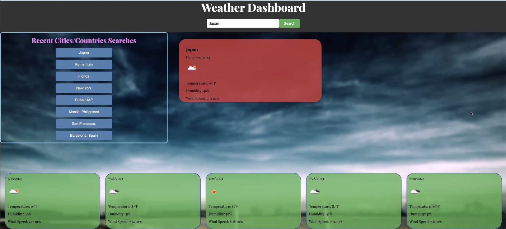

# Weather Dashboard

## Live URL

[Weather Dashboard Live](https://your-live-url-here)

## Live Repository

[Weather Dashboard Repository](https://github.com/hyperlitz/weatherforecast)

## Description

Weather Dashboard is a web application that allows users to search for the weather of a city or country. It provides users with the current weather and a 5-day forecast using data fetched from the OpenWeatherMap API. The application also keeps track of recent searches for easy access.

## Screenshots

1. Weather Dashboard - Current Weather

2. Weather Dashboard - 5-Day Forecast

## Technologies Used

- HTML
- CSS
- JavaScript
- [OpenWeatherMap API](https://openweathermap.org/api)

## Features

- Search for weather by city name.
- Displays current weather information including temperature, humidity, wind speed, and an icon representation.
- Shows a 5-day forecast with date, temperature, humidity, and wind speed for each day.
- Keeps track of recent searches and displays them as buttons for easy access.

## How to Use

1. Clone the repository from GitHub:

git clone https://github.com/hyperlitz/weatherforecast.git

2. Navigate to the Project Directory: 

cd your-repo-name

3. Open the index.html file in your preferred web browser to view the Weather Dashboard.

## Contributing

Contributions are welcome! If you find any issues or would like to add new features, feel free to submit a pull request.

## License

This project is licensed under the MIT License - see the [LICENSE](https://github.com/your-github-username/your-repo-name/blob/main/LICENSE) file for details.